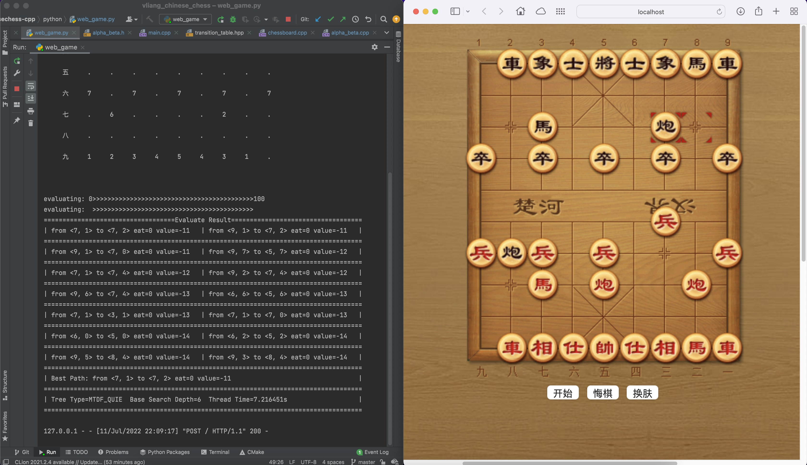

# 微量 - 中国象棋 Vliang - Chinese Chess

------
👤作者：睿

📧邮件：rayZhh@163.com

------



## 简介

这个项目是我仓库中使用java实现的 [vlumino-chinese chess] 的c++复现，同时优化了代码的结构，优化了置换表和历史表。 经对比，相同局面新的项目评估速度更快（约3倍的性能）。
和我仓库中java项目相同：采用多线程加速评估。开局和中盘棋力还不错。开局支持深度为6+8的静态搜索，或者深度为8的mtd(f)搜索。随着后面盘面的简化允许更高的深度。 评估的速度和CPU性能相关。以我的电脑 19 15.4 macbook
pro 为例：CPU型号为 Core i9-9880h @2.3GHz，开局阶段使用深度为8的mtd(f)搜索时间约为3-5秒，这已经是非常不错的成绩了，我相信这得益于c++优良的性能和采用的各种剪枝算法。

相比我的java的实现稍有改进，因此我在开局尝试深度为6+10的静态搜索，发现效果很不错。于是在这个版本中我不准备设计开局库了。

## 支持的算法

·记忆化的alpha-beta搜索（历史表启发，置换表优化）

·mtd(f)搜索

·静态搜索

·所有搜索算法都使用多线程优化，每个线程负责一个候选路径的评估。

## 说明

·main.cpp中有控制台游戏，直接运行即可。可以尝试不同的搜索算法。

·暂时不支持开局库（事实上我发现使用静态搜索进行开局效果还不错）。

·核心算法用c++实现，编译后使用python调用exe作为接口，方便快速构建服务端。

·我对前端一窍不通，因此前端是抄的，具体逻辑稍微改了下，倒是能玩。

## 编译运行（命令行运行）

```shell
g++ -std=c++20 -O3 -o chess main.cpp source/*.cpp
./chess
```

## GUI

1.运行 [python/web_game.py]

2.在浏览器中打开 [web/index.html]
然后就可以玩了。 在 web_game.py中可以调节搜索方式和搜索深度。一般开局使用深度为8的mtdf搜索[TreeType.MTDF]，或深度为6的静态搜索[TreeType.MTDF_QUIE]（推荐，目测更强）。

## 如何进行评估？

```c++
#include "include/multi_thread_evaluator.h"

int main() {
    Chessboard board;
    
    board.move_chess(ChessPath(2, 1, 2, 4, 0));
    
    board.print_chessboard();
    
    // 创建评估器，有这两种方式，目前仅支持多线程评估器
    // 如果需要评估 《棋子为正数一方》的最佳路径，传入 TreeSearchBase::MAX_LAYER_SIGN，反之用MIN
    MultiThreadEvaluator evaluator(board, 8, TreeType::MTDF /*   , TreeSearchBase::MAX_LAYER_SIGN */); 
    MultiThreadEvalautor evalator_1(board, 6, TreeType::MTDF_QUIE, TreeSearchBase::MAX_LAYER_SIGN   );
    
    // 评估
    auto path = evaluator.get_best_path();
    // 落子
    board.move_chess(path);
    
    return 0;
}
```

## 一些问题

暂时无法避免长将，长抓等问题。不过这些都不涉及核心的算法，比较好解决。